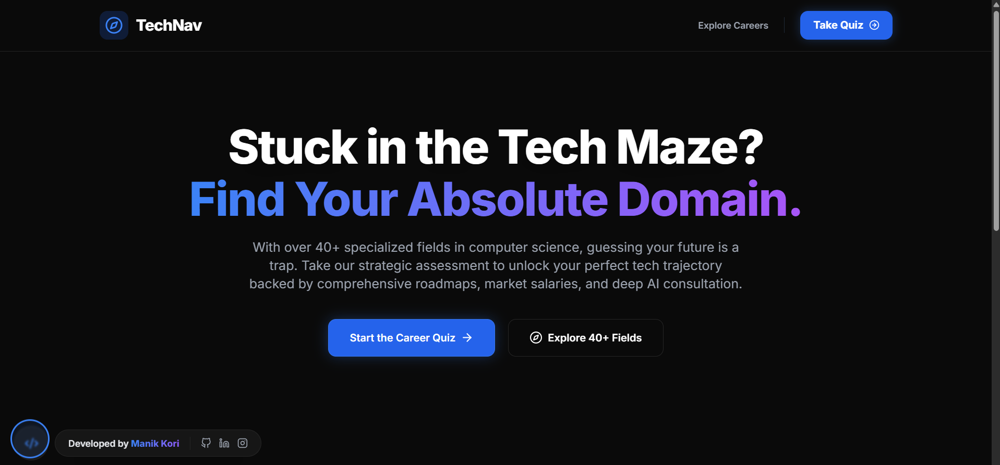
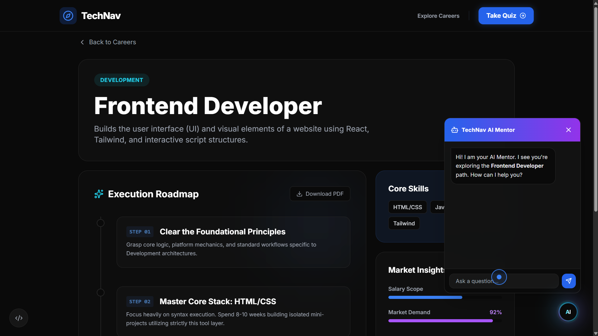
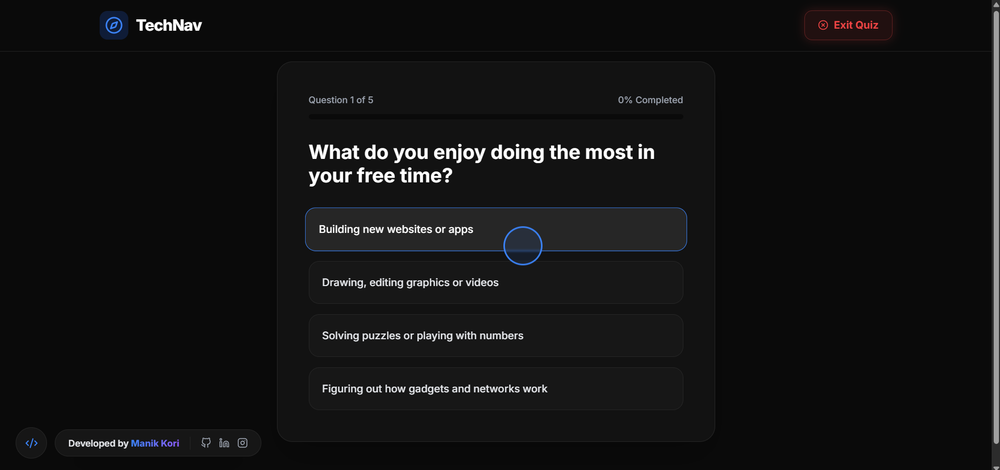
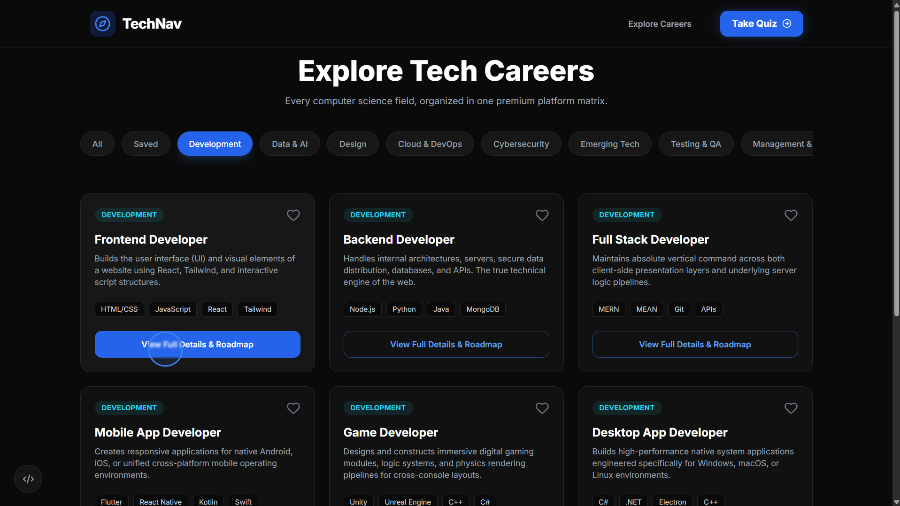

# TechNav: The Ultimate Career Navigation Matrix 🚀

**TechNav** is a premium, AI-powered web platform engineered to solve the chronic confusion faced by Computer Science students when navigating the vast ecosystem of modern tech careers. 

---

## 📸 Project Screenshots

### 1. Home Page & Spotlight Matrix

### 2. Context-Aware AI Mentor (Liquid Core)

### 3. Natural Interest Career Quiz

### 4. Explore tech careers
 

---

## 💡 The Problem
The tech industry is evolving at a breakneck speed, with over **40+ specialized career domains**. Students constantly face:
* **Analysis Paralysis:** Inability to choose a path due to scattered, fragmented information across the internet.
* **Misalignment:** Wasting semesters on domains that contradict their natural cognitive strengths.
* **Lack of Execution:** A massive disconnect between knowing a field and having a structured, industry-ready roadmap to master it.

## 🚀 The Solution
TechNav standardizes the transition from student to professional by creating a personalized **Career Matrix**:
* **Natural Interest Quiz:** An algorithmic assessment that maps user cognitive responses to the most compatible tech domains.
* **Context-Aware AI Mentor:** A real-time, domain-specific AI assistant that guides students, answers doubts, and provides salary insights.
* **Structured Roadmaps:** Step-by-step execution timelines for every single career track.
* **Market Intelligence:** Live data visualization mapping market demands and actual salary packages.

---

## ✨ Key Features & UX Innovations
* **Immersive Hacker/Tech UI:** Locked in a strict dark theme with a dynamic **Spotlight Grid** that reacts to mouse movements.
* **Fluid Navigation:** Integrated **Custom Cursor** (trailing ring mechanics) and **Lenis Smooth Scrolling** for a premium web experience.
* **Liquid AI Orb:** A floating, animated AI mentor component available globally across the application.
* **Distraction-Free Zones:** Specialized navigation states (e.g., immediate "Exit Quiz" escape hatches) to keep users focused.
* **Fully Responsive:** Sleek Glassmorphism hamburger menus designed specifically for mobile users.

---

## 🛠 Tech Stack
We built this platform using a modern, high-performance web architecture:

### **Frontend**
* **React 19 & Vite:** Lightning-fast UI rendering and build tooling.
* **Tailwind CSS:** Utility-first styling for the strict dark-mode matrix UI.
* **Framer Motion & GSAP:** Complex component animations, page transitions, and text reveals.
* **React Router DOM:** Seamless Single Page Application (SPA) routing.

### **Backend & AI Engine**
* **Node.js & Express:** Robust server-side architecture.
* **MongoDB:** Database infrastructure.
* **Groq API (Llama 3):** High-speed, context-aware AI text generation for the Mentor module.

### **Deployment**
* **Vercel:** Optimized production hosting with custom build configurations and route rewrites.

---

## 📦 How to Run Locally

1. **Clone the repository:**
   `git clone [https://github.com/manikkori/techNavigator.git](https://github.com/manikkori/techNavigator.git)`

2. **Install dependencies:**
   `npm install --legacy-peer-deps`

3. **Setup Environment Variables:**
   Create a `.env` file in the root folder and add your AI API key:
   `VITE_GROQ_API_KEY=your_actual_api_key_here`

4. **Start the local development server:**
   `npm run dev`

---

## Developer
Developed by Manik.
